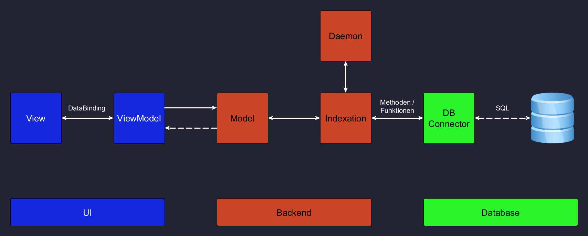

<!-- so portfolio mäßig -->

# FileIndexer

### SAE Projekt - E2FI5 - Gruppe 2

<!-- evtl hier bild(er) vom programm -->

---

  

## Ziel des Projekts:

Eine WPF-app erstellen, die folgendes tut:

1. Beim Start alle Dateipfade und Dateiinhalte ab einem bestimmten Pfad rekursiv indexieren , dh. eine Liste von allen Dateipfaden und Dateiinhalten in allen Unterordnern erstellen
2. Diese indexierung sollte entweder auf Intervall, oder nur wenn sich Dateien ändern / hinzugefügt / entfernt werden, erneut ausgeführt werden
3. Diese Liste in eine (oder mehrere) Datenbank-Tabelle schreiben, sodass man in Schritt 4 eine sehr schnelle und effiziente Suche hat
4. Eine Suchleiste einbauen, die von diesen Datenbank-Einträgen die passenden raussucht und anzeigt

Optionale Features:

- Erkennen von externen Laufwerken wie USB Sticks, die auch sofort indexiert werden

  

## Aufgabenverteilung:

| Wer?                                                    | Hauptaufgabe |
| :------------------------------------------------------ | :----------- |
| **Giuseppe** ([@Anchor05](https://github.com/Anchor05)) | Datenbank    |
| **Emin** ([@schneemin](https://github.com/schneemin))   | Oberfläche   |
| **Sven** ([@Sv443](https://github.com/Sv443))           | Backend      |
| **Nico** ([@itsoggin](https://github.com/itsoggin))     | Variabel     |

  

## Arbeits-Organisierung:

- Wir erstellen für bestimmte Features ein Issue ([hier](https://github.com/Sv443/FileIndexer/issues/new/choose))
- Wir fügen dieses Issue dann in unser Projekt-Board ein ([hier](https://github.com/Sv443/FileIndexer/projects/1)), das macht alle Aufgaben und deren Status übersichtlich
- Im Projekt-Board werden dann die Issues bearbeitet und geschlossen, wenn sie fertig sind
- Jeder bekommt seinen eigenen Branch und die werden dann per Pull Request ([hier](https://github.com/Sv443/FileIndexer/pulls)) auf den Haupt-Code (`main` Branch) übertragen

  

## Projekt-Übersicht:

 

  

---
